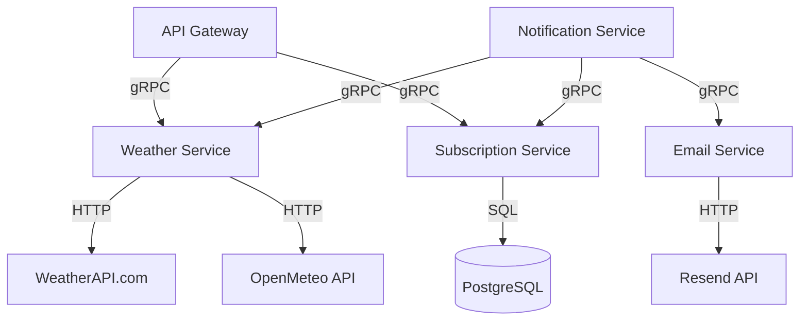

# ADR-003: Microservices Migration for Weather Subscription Application

**Date:** 2025-07-05

**Status:** Accepted

**Author:** Herman Hrand

**Current Architecture:**

- Monolithic application with modular structure
- Hexagonal architecture with clear separation between primary/secondary adapters and domain logic

**Microservices Architecture Requirements:**

- Independent service deployment
- Horizontal scaling of individual components
- Fault isolation between services
- Ability to use different technologies for different services

## Choices

### Microservice Extraction Options:

#### 1. **Weather Service** (Weather Data Operations)

**Responsibilities:**

- Integration with external weather APIs (WeatherAPI, OpenMeteo)
- Weather data caching and aggregation
- City name validation
- Chain of responsibility pattern for multiple weather providers

**Justification for extraction:**

- High external API dependency requiring isolation
- Independent scaling based on weather data request patterns
- Ability to add new weather providers without system-wide changes
- Clear bounded context for weather-related operations

#### 2. **Subscription Service** (Subscription Management)

**Responsibilities:**

- Subscription lifecycle management (create, confirm, delete)
- JWT token generation and validation
- Database operations for subscription data
- User authentication and authorization

**Justification for extraction:**

- Core business domain with distinct lifecycle
- Different scaling requirements from other services
- Independent data model and persistence needs
- Clear separation of subscription-related concerns

#### 3. **Notification Service** (Notification Orchestration)

**Responsibilities:**

- Cron-based scheduling for periodic notifications
- Subscription frequency processing (hourly/daily)
- Orchestration between Weather and Email services
- Batch processing of subscriber notifications

**Justification for extraction:**

- Complex scheduling and orchestration logic
- Resource-intensive batch processing requiring independent scaling
- Central coordination point that can be optimized separately
- Clear separation of notification timing concerns

#### 4. **Email Service** (Email Operations)

**Responsibilities:**

- Email delivery via Resend API
- Template rendering and email formatting
- Delivery status tracking and error handling
- Email provider abstraction layer

**Justification for extraction:**

- External service dependency requiring isolation
- Reusable across multiple notification types
- Independent failure handling and retry logic
- Potential for different email providers

#### 5. **API Gateway Service** (External Interface)

**Responsibilities:**

- External API endpoint management
- Request routing to appropriate services
- Authentication and rate limiting
- API documentation and OpenAPI specification

**Justification for extraction:**

- Single entry point for external clients
- Cross-cutting concerns (auth, logging, metrics)
- Independent scaling for API traffic
- Clear separation of external interface concerns

### Microservice Communication Options:

#### 1. **Synchronous HTTP/REST API**

**Pros:**

- Simple implementation and debugging
- Familiar technology for the team
- Support in existing infrastructure (Hono framework)
- Straightforward error handling

**Cons:**

- Tight coupling between services
- Potential cascading failures
- Higher latency with chained calls
- Complexity in handling temporary service unavailability

#### 2. **Message Queue (Asynchronous)**

**Pros:**

- Loose coupling between services
- Better fault tolerance
- Ability to handle peak loads
- Natural support for eventual consistency

**Cons:**

- Complexity of setup and monitoring
- Additional infrastructure needed (Redis/RabbitMQ/Apache Kafka)
- Debugging complexity for distributed workflows
- Need for additional team skills

#### 3. **gRPC (Remote Procedure Calls)**

**Pros:**

- High performance with binary protocol (Protocol Buffers)
- Strong typing and contract-first development
- Built-in support for streaming and bi-directional communication
- Language-agnostic service definitions
- Runs over HTTP/2 with multiplexed streams over a single TCP connection, reducing latency compared to HTTP/1.1

**Cons:**

- Steeper learning curve for the team
- Less human-readable than REST
- Additional tooling required for debugging and testing
- Limited browser support without gRPC-Web

## Decision

**Extracted Microservices:**

1. **Weather Service** - weather data operations and external API integration
2. **Subscription Service** - subscription management and user authentication
3. **Notification Service** - scheduling and notification orchestration
4. **Email Service** - email delivery and template processing
5. **API Gateway Service** - external interface and request routing

**Chosen Communication Strategy:** **gRPC**

**Service Communication (gRPC):**

- API Gateway → Weather Service (direct weather data requests)
- API Gateway → Subscription Service (subscription operations)
- Notification Service → Weather Service (weather data for notifications)
- Notification Service → Subscription Service (subscription queries)
- Notification Service → Email Service (email delivery requests)

**Rationale:**

- gRPC for all service-to-service communication provides high performance and strong typing
- HTTP/2 with multiplexed streams over a single TCP connection reduces latency compared to HTTP/1.1
- Protocol Buffers ensure contract-first development and type safety
- Built-in streaming capabilities for efficient data transfer
- API Gateway handles external HTTP/REST for client compatibility while internal services use gRPC
- Simplified architecture without additional infrastructure dependencies

### Architecture Diagram

## Consequences

**Positive Impact:**

- **Independent scaling:** each of the five services can scale based on specific load patterns
- **Fault isolation:** failures in Weather, Email, or other services don't cascade
- **Technology flexibility:** different services can use optimal technologies (e.g., different databases)
- **Team independence:** separate teams can own Weather, Subscription, Notification, Email, and Gateway services
- **Clear boundaries:** well-defined interfaces between Weather, Subscription, Notification, Email, and API Gateway
- **External dependency isolation:** Weather and Email services isolate external API dependencies

**Negative Impact:**

- **Infrastructure complexity:** need for service discovery, API Gateway, and monitoring across five services
- **Distributed system challenges:** debugging across Weather, Subscription, Notification, Email, and Gateway services
- **Network latency:** additional network hops between services for weather data and notification flows
- **Data consistency:** ensuring consistency between Subscription and Notification services
- **Operational overhead:** monitoring and maintaining five independent services with different deployment cycles

**Risks and Mitigations:**

- **Risk:** complexity of debugging distributed systems
  **Mitigation:** implement distributed tracing (Jaeger/Zipkin) and centralized logging
- **Risk:** network partitions and service unavailability
  **Mitigation:** implement circuit breakers, retries, and graceful degradation
- **Risk:** data inconsistency
  **Mitigation:** use eventual consistency patterns and compensating transactions

**Migration Plan:**

1. **Phase 1:** Extract API Gateway Service to handle external routing and cross-cutting concerns
2. **Phase 2:** Extract Weather Service as an independent service with caching capabilities
3. **Phase 3:** Extract Email Service and implement asynchronous communication patterns
4. **Phase 4:** Extract Subscription Service with independent database and JWT handling
5. **Phase 5:** Extract Notification Service and complete the five-service microservices architecture
