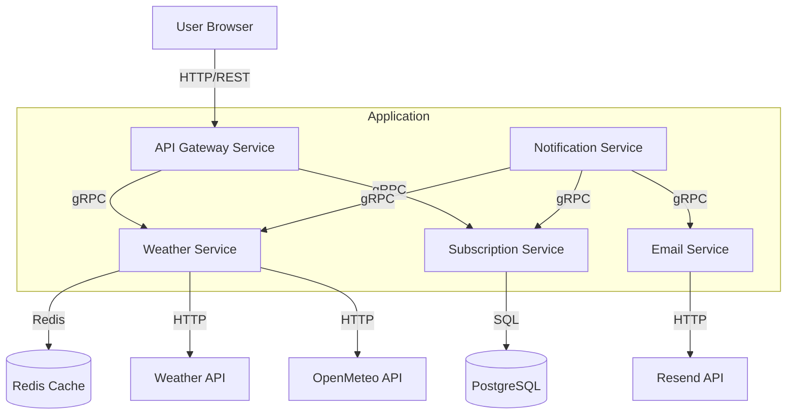

# System Design: Weather Subscription

## 1. Requirements

### Functional Requirements:

- Fetch current weather data for a given city (temperature, humidity, and weather description)
- Allow users to subscribe to weather updates for specific cities
- Support both daily and hourly update frequencies
- Require email confirmation for new subscriptions
- Allow users to unsubscribe from weather updates
- Send email notifications with weather updates according to subscription frequency
- Provide endpoints for weather data retrieval, subscription, confirmation, and unsubscription
- Users must be able to repeat subscription requests to mitigate cases where they don't receive the confirmation email
- Subscriptions cannot be activated after the token expiration period (30 minutes) to ensure only engaged users complete the process

### Non-Functional Requirements:

- **Availability:** 99.9% uptime
- **Scalability:** Support up to 10,000 concurrent users
- **Performance:** Response time under 200ms for API requests
- **Reliability:** Ensure reliable email delivery

### Constraints:

- **Budget:** Minimal cost, preferably using free or low-cost services
- **External API rate limits:** Under 1000 requests per day
- **Testing:** Automated E2E tests for the API endpoints
- **Technologies:** `Node.js` and `PostgreSQL`

## 2. Expected load

### Users and bandwidth:

- **Active Users:** 50k
- **Subscriptions per user:** 1
- **API requests:** 1000 RPS (peak)
- **Emails:** 100k/day

### Data:

- **Weather data size:** ~1KB per request
- **Subscription data size:** ~500B per subscription
- **Database size:** ~50GB (assuming 100k subscriptions and 1k weather requests per day)

### Bandwidth:

- **Incoming:** 1Mbps
- **Outgoing:** 10Mbps (emails)
- **External API:** 50Mbps

## 3. High-Level Architecture

## 4. Detailed Components Design

### 4.1 API Gateway Service

- **Responsibilities:**
  - Handle incoming HTTP/REST API requests from clients
  - Route requests to appropriate microservices
  - Provide OpenAPI documentation and Swagger UI
  - Handle cross-cutting concerns (logging, validation)
- **Endpoints:**
  - `POST /api/subscribe`: Create a new subscription
  - `GET /api/confirm/:token`: Confirm a subscription
  - `GET /api/unsubscribe/:token`: Remove a subscription
  - `GET /api/weather?city=:city`: Fetch current weather data
- **Technologies:**
  - Node.js with TypeScript
  - Hono framework for HTTP routing and OpenAPI integration
  - Zod for request validation and schema definition
  - gRPC clients for internal service communication

### 4.2 Weather Service

- **Responsibilities:**
  - Fetch weather data from external weather APIs
  - Validate city names
  - Cache weather data for performance
  - Provide metrics for monitoring
- **Features:**
  - Chain of responsibility pattern for multiple weather providers (WeatherAPI, OpenMeteo)
  - Redis caching with TTL for weather data
  - Circuit breaker pattern for external API failures
  - Prometheus metrics collection
- **Technologies:**
  - Node.js with TypeScript
  - gRPC server for internal communication
  - Redis for caching
  - Multiple weather API providers (WeatherAPI.com, OpenMeteo)

### 4.3 Subscription Service

- **Responsibilities:**
  - Subscription lifecycle management (create, confirm, delete)
  - JWT token generation and validation
  - Database operations for subscription data
  - Batch processing for notification service
- **Features:**
  - JWT-based subscription confirmation with 30-minute expiration
  - PostgreSQL database with Drizzle ORM
  - Iterator pattern for batch processing subscriptions
  - Dataloader for efficient weather data fetching
- **Technologies:**
  - Node.js with TypeScript
  - gRPC server for internal communication
  - PostgreSQL with Drizzle ORM
  - Fast-JWT for token management

### 4.4 Email Service

- **Responsibilities:**
  - Send confirmation emails for new subscriptions
  - Deliver weather update emails to subscribers
  - Render email templates
  - Handle email delivery failures
- **Features:**
  - React-based JSX templates for email content
  - Subscription confirmation emails with verification links
  - Weather update emails with unsubscribe links
  - Integration with Resend API for reliable delivery
- **Technologies:**
  - Node.js with TypeScript
  - gRPC server for internal communication
  - Resend API for email delivery
  - React JSX for email templates

### 4.5 Notification Service

- **Responsibilities:**
  - Schedule recurring weather updates
  - Orchestrate weather data fetching and email sending
  - Execute jobs based on subscription frequency
  - Coordinate between Subscription, Weather, and Email services
- **Features:**
  - Cron-based scheduling (daily at midnight, hourly at the top of each hour)
  - Batch processing of subscriptions
  - gRPC communication with other services
  - Fault tolerance and error handling
- **Technologies:**
  - Node.js with TypeScript
  - Croner for cron-based job scheduling
  - gRPC clients for service communication

## 5. Data Flow

### 5.1 Subscription Flow

1. User submits subscription request to API Gateway via HTTP/REST
2. API Gateway forwards request to Subscription Service via gRPC
3. Subscription Service calls Weather Service via gRPC to validate city
4. Subscription Service generates JWT token with 30-minute expiration
5. Subscription Service calls Email Service via gRPC to send confirmation email
6. Email Service sends confirmation email with token link via Resend API
7. User clicks confirmation link within expiration period
8. API Gateway routes confirmation to Subscription Service
9. Subscription Service verifies token and creates subscription record in PostgreSQL

### 5.2 Weather Update Flow

1. Notification Service cron job triggers based on frequency (hourly/daily)
2. Notification Service calls Subscription Service via gRPC to fetch active subscriptions
3. Notification Service calls Weather Service via gRPC for each unique city
4. Weather Service fetches data from external APIs (with Redis caching)
5. Notification Service calls Email Service via gRPC to send weather updates
6. Email Service formats weather data into React-based email templates
7. Email Service sends emails with weather updates and unsubscribe links via Resend API

### 5.3 Unsubscription Flow

1. User clicks unsubscribe link from email
2. API Gateway routes request to Subscription Service via gRPC
3. Subscription Service identifies subscription by UUID and removes from PostgreSQL

### 5.4 Weather Data Retrieval Flow

1. User requests weather data via API Gateway
2. API Gateway forwards request to Weather Service via gRPC
3. Weather Service checks Redis cache for existing data
4. If cache miss, Weather Service fetches from external APIs (WeatherAPI/OpenMeteo)
5. Weather Service stores result in Redis cache with TTL
6. Weather Service returns data to API Gateway via gRPC
7. API Gateway returns formatted response to user

## 6. Deployment Strategy

### 6.1 Microservices Architecture

The application is deployed as five independent microservices:

- **API Gateway Service** (Port 3000): External HTTP/REST interface
- **Weather Service** (Port 4001): Weather data operations with Redis caching
- **Email Service** (Port 4002): Email delivery and template rendering
- **Subscription Service** (Port 4003): Subscription management with PostgreSQL
- **Notification Service**: Background service for scheduled notifications (single instance only)

### 6.2 Containerization

- Docker containers for each microservice
- Multi-stage builds for optimized production images
- Docker Compose for local development and testing
- Separate Docker profiles for development and production environments

### 6.3 Service Communication

- **External Communication**: HTTP/REST API via API Gateway
- **Internal Communication**: gRPC with Protocol Buffers for type safety
- **Service Discovery**: Direct service-to-service communication via Docker networking
- **Load Balancing**: Container-level load balancing with Docker Compose

### 6.4 Data Storage

- **PostgreSQL**: Primary database for subscription data
- **Redis**: Caching layer for weather data with TTL
- **Persistent Volumes**: Docker volumes for data persistence

### 6.5 CI/CD

- GitHub Actions for automated testing and building
- Separate workflows for each microservice
- Container image building and registry management
- Automated database migrations during deployment

## 7. Security Considerations

### 7.1 JWT Implementation

- JWT tokens with short expiration (30 minutes) for subscription verification
- Signed tokens to prevent tampering

### 7.2 Data Protection

- Validation of all user inputs
- No sensitive user data stored beyond email address
- HTTPS for all communications

## 8. Testing Strategy

### 8.1 Testing

- Automated tests for services and controllers using Vitest
- Mocked external services (Weather API, Email) for consistent testing
- Test coverage for subscription and weather retrieval flows
- Separation of test concerns with isolated test contexts

### 8.2 Continuous Integration

- Automated tests run on each commit via GitHub Actions
- Test environment isolation using Docker
- Separate workflows for different types of tests

## 9. Design Decisions

### 9.1 JWT for Subscription Verification

The application uses JWT tokens rather than storing pending subscriptions in the database for several reasons:

- Reduced database overhead by avoiding temporary records
- Simplified subscription management process
- Stateless verification without additional database queries
- 30-minute expiration ensures timely completion of the subscription process

### 9.2 Scheduling Approach

The application uses Croner for in-memory scheduling instead of a message queue system because:

- Weather updates have precise timing requirements (hourly/daily)
- Simplifies the architecture by avoiding additional infrastructure
- In-memory scheduling is sufficient for the expected load
- User experience is prioritized by ensuring consistent timing of updates
- Failed delivery attempts are not retried to avoid unexpected timing of weather updates

## 10. Future Enhancements

### 10.1 Short-term Improvements

- Implement a simple web UI for subscription management
- Implement rate limiting on API endpoints for security and resource management
- Add detailed monitoring and alerting for system health

### 10.2 Long-term Vision

- User accounts for managing multiple subscriptions
- Additional weather data metrics and visualizations
- Mobile notifications as an alternative to email
- Consider implementing a queue system like BullMQ or pg-boss for improved scalability while maintaining consistent user experience
- Implement a WebSocket API for real-time weather updates
- Personalized weather insights based on user preferences and historical data
