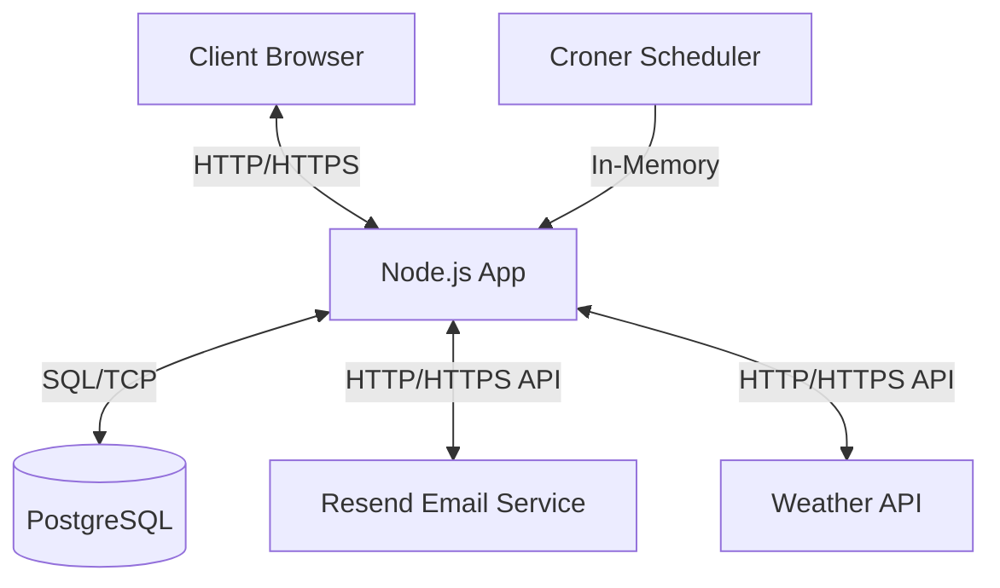

# System Design: Weather Subscription

## 1. Requirements

### Functional Requirements:

- Fetch current weather data for a given city (temperature, humidity, and weather description)
- Allow users to subscribe to weather updates for specific cities
- Support both daily and hourly update frequencies
- Require email confirmation for new subscriptions
- Allow users to unsubscribe from weather updates
- Send email notifications with weather updates according to subscription frequency
- Provide endpoints for weather data retrieval, subscription, confirmation, and unsubscription
- Users must be able to repeat subscription requests to mitigate cases where they don't receive the confirmation email
- Subscriptions cannot be activated after the token expiration period (30 minutes) to ensure only engaged users complete the process

### Non-Functional Requirements:

- **Availability:** 99.9% uptime
- **Scalability:** Support up to 10,000 concurrent users
- **Performance:** Response time under 200ms for API requests
- **Reliability:** Ensure reliable email delivery

### Technical Requirements:

- **Budget:** Minimal cost, preferably using free or low-cost services
- **External API rate limits:** Under 1000 requests per day
- **Testing:** Automated E2E tests for the API endpoints
- **Technologies:** `Node.js` and `PostgreSQL`

## 2. Expected load

### Users and bandwidth:

- **Active Users:** 50k
- **Subscriptions per user:** 1
- **API requests:** 1000 RPS (peak)
- **Emails:** 100k/day

### Data:

- **Weather data size:** ~1KB per request
- **Subscription data size:** ~500B per subscription
- **Database size:** ~50GB (assuming 100k subscriptions and 1k weather requests per day)

### Bandwidth:

- **Incoming:** 1Mbps
- **Outgoing:** 10Mbps (emails)
- **External API:** 50Mbps

## 3. High-Level Architecture

## 4. Detailed Components Design

### 4.1 API Service

- **Responsibilities:**
  - Handle incoming API requests
  - Validate and process subscription requests
  - Fetch weather data from external API
  - Send email notifications
  - Manage user subscriptions
- **Endpoints:**
  - `POST /api/subscribe`: Create a new subscription
  - `GET /api/confirm/:token`: Confirm a subscription
  - `GET /api/unsubscribe/:token`: Remove a subscription
  - `GET /api/weather?city=:city`: Fetch current weather data
- **Technologies:**
  - Node.js with TypeScript
  - Hono framework for routing and OpenAPI integration
  - Pino for structured logging
  - Zod for request validation and schema definition
  - Fast-JWT for secure token generation and verification

### 4.2 Database Service

- **Responsibilities:**
  - Store user subscription data
  - Maintain data consistency
  - Support efficient querying
- **Schema:**
  - `subscriptions` table:
    - `id`: UUID (Primary Key)
    - `email`: VARCHAR (255)
    - `city`: VARCHAR (255)
    - `frequency`: VARCHAR (10) - 'hourly' or 'daily'
    - `created_at`: TIMESTAMP (3) WITH TIME ZONE
- **Technologies:**
  - PostgreSQL
  - Drizzle ORM for type-safe database interactions
  - Drizzle Kit for schema migrations and version control

### 4.3 Weather Service

- **Responsibilities:**
  - Fetch weather data from external API
  - Validate city names
  - Format weather data for consumption
- **Features:**
  - Error handling for API failures
  - City validation before subscription
- **Technologies:**
  - WeatherAPI.com as the external weather data provider

### 4.4 Email Service

- **Responsibilities:**
  - Send confirmation emails for new subscriptions
  - Deliver weather updates to subscribers
  - Provide unsubscribe links in all emails
- **Email Types:**
  - Subscription confirmation emails with verification link
  - Daily weather updates with current conditions
  - Hourly weather updates with current conditions
- **Technologies:**
  - Resend for reliable email delivery
  - React-based JSX templates for email content

### 4.5 Scheduler Service

- **Responsibilities:**
  - Schedule recurring weather updates
  - Execute jobs based on subscription frequency
- **Features:**
  - Daily scheduler for daily subscriptions (runs at midnight)
  - Hourly scheduler for hourly subscriptions (runs at the top of each hour)
- **Technologies:**
  - Croner for cron-based job scheduling

## 5. Data Flow

### 5.1 Subscription Flow

1. User submits subscription request with email, city, and frequency
2. System validates the city with Weather API
3. System generates a confirmation token using JWT with a 30-minute expiration
4. System sends confirmation email with token link
5. User clicks confirmation link within the expiration period
6. System verifies token and creates subscription record
7. System includes subscription in the appropriate scheduler based on frequency

### 5.2 Weather Update Flow

1. Scheduler triggers job based on subscription frequency (hourly or daily)
2. System fetches active subscriptions for the current frequency
3. For each subscription, system fetches current weather data for the subscribed city
4. System formats weather data into a React-based email template
5. System sends email with weather update and unsubscribe link

### 5.3 Unsubscription Flow

1. User clicks unsubscribe link from email
2. System identifies the subscription by ID (UUID)
3. System removes subscription record from database

## 6. Deployment Strategy

### 6.1 Containerization

- Docker for application packaging
- Docker Compose for local development and testing

### 6.2 CI/CD

- GitHub Actions for automated testing and building
- Separate workflows for build and test processes
- Automated database migrations during deployment

## 7. Security Considerations

### 7.1 JWT Implementation

- JWT tokens with short expiration (30 minutes) for subscription verification
- Signed tokens to prevent tampering

### 7.2 Data Protection

- Validation of all user inputs
- No sensitive user data stored beyond email address
- HTTPS for all communications

## 8. Testing Strategy

### 8.1 E2E Testing

- Automated tests for all API endpoints using Vitest
- Mocked external services (Weather API, Email) for consistent testing
- Test coverage for subscription and weather retrieval flows
- Separation of test concerns with isolated test contexts

### 8.2 Continuous Integration

- Automated tests run on each commit via GitHub Actions
- Test environment isolation using Docker
- Separate workflows for different types of tests

## 9. Design Decisions

### 9.1 JWT for Subscription Verification

The application uses JWT tokens rather than storing pending subscriptions in the database for several reasons:

- Reduced database overhead by avoiding temporary records
- Simplified subscription management process
- Stateless verification without additional database queries
- 30-minute expiration ensures timely completion of the subscription process

### 9.2 Scheduling Approach

The application uses Croner for in-memory scheduling instead of a message queue system because:

- Weather updates have precise timing requirements (hourly/daily)
- Simplifies the architecture by avoiding additional infrastructure
- In-memory scheduling is sufficient for the expected load
- User experience is prioritized by ensuring consistent timing of updates
- Failed delivery attempts are not retried to avoid unexpected timing of weather updates

## 10. Future Enhancements

### 10.1 Short-term Improvements

- Implement a simple web UI for subscription management
- Add LRU cache with TTL for Weather API calls to reduce costs and improve performance
- Implement rate limiting on API endpoints for security and resource management
- Add detailed monitoring and alerting for system health

### 10.2 Long-term Vision

- Support for multiple weather data sources for redundancy and enriched data
- User accounts for managing multiple subscriptions
- Additional weather data metrics and visualizations
- Mobile notifications as an alternative to email
- Consider implementing a queue system like BullMQ or pg-boss for improved scalability while maintaining consistent user experience
- Horizontal scaling of the Node.js application using a load balancer
- Implement a WebSocket API for real-time weather updates
- Personalized weather insights based on user preferences and historical data
